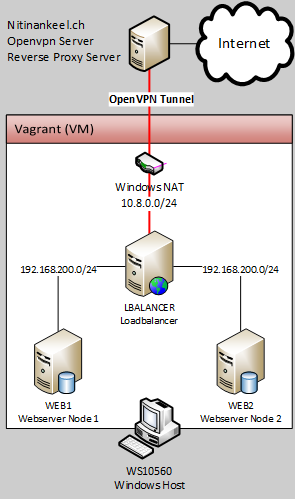

# Modul300 LB
Nitinan Keel </br>
Cloud / Dynamic Infrastructure Platforms
## Table of Contents

* [Concept](https://github.com/Nitikee/Modul300#concept)
  * [Requirements](https://github.com/Nitikee/Modul300#concept)
  * [Networkdiagram](https://github.com/Nitikee/Modul300#networkdiagramm)
  * [IP table](https://github.com/Nitikee/Modul300#ip-table)
  * [Reverse proxy](https://github.com/Nitikee/Modul300#reverse-proxy)
* [Installation](https://github.com/Nitikee/Modul300#installation)
  * [Setup external server](https://github.com/Nitikee/Modul300#setup-external-server)
    * [OpenVPN server](https://github.com/Nitikee/Modul300#openvpn-server)
    * [NGINX server](https://github.com/Nitikee/Modul300#nginx-server)
      * [Reverse proxy configuration](https://github.com/Nitikee/Modul300#reverse-proxy-configuration)
  * [Setup vagrant server](https://github.com/Nitikee/Modul300#setup-vagrant-server)
    * [Setup folders and required files](https://github.com/Nitikee/Modul300#setup-folders-and-required-files)
    * [Vagrant file](https://github.com/Nitikee/Modul300#vagrant-file)
* [Testing](https://github.com/Nitikee/Modul300#testing)
* [Project review](https://github.com/Nitikee/Modul300#project-review)

## Concept
### Requirements:
* [Vagrant](https://www.vagrantup.com/downloads.html)
* [VirtualBox](https://www.virtualbox.org/wiki/Downloads)
* [Git](https://git-scm.com/download/win)

## Networkdiagramm

 

### IP Table
| Host | IP-Address | Ports | Description |
| ---- | --------- | ----- | ----------- |
| LBALANCER | 192.168.200.1 /24 | TCP 80 | Loadbalancer |
| LBALANCER | 10.8.0.x /24 | - | OpenVPN connection |
| WEB1 | 192.168.200.10 /24 | TCP 80 | Webserver Node 1 |
| WEB2 | 192.168.200.11 /24 | TCP 80 | Webserver Node 2 |
| Nitinankeel.ch | 10.8.0.1 /24 | UDP 1994 | OpenVPN Server |
| Nitinankeel.ch | 185.101.157.122 /24 | TCP 443, 80 | HTTPS (Reverse Proxy) |

### Reverse proxy
For security reasons I will setup a reverse proxy on nitinankeel.ch for the vagrant server "lbalancer". The reverse Proxy will redirect vagrant.nitinankeel.ch to 10.9.0.1 (Loadbalancer openvpn IP address).
One Bonus point, I just need to configure HTTPS on the external Server. The connection from nitinankeel.ch to the loadbalancer is over HTTP.  

## Installation

### Setup external server
Our Loadbalancing vagrant server does **not** have a public IP. 
In order to get connections from the interwebs it must be connected with an external OpenVPN server (nitinankeel.ch).
Reverse proxy the connection to the connected openvpn client (Loadbalancer).

#### OpenVPN server
How to install the OpenVPN Server on ubuntu:
https://www.digitalocean.com/community/tutorials/how-to-set-up-an-openvpn-server-on-ubuntu-16-04

After we installed the server and created a OpenVPN profile (in my Case: SVMB01.ovpn), we need to assing a static IP for this profile.

Open your OpenVPN server's configuration (``/etc/openvpn/yourserver.conf``) and uncomment or add this line:
```bash
client-config-dir ccd
route 10.9.0.0 255.255.255.252
```
Next we create the client-config-dir we’ve specified above:
```bash
sudo mkdir /etc/openvpn/ccd
```
Now create a file with the exact name like the OpenVPN profile (SVMB01) and add this line:
```bash
ifconfig-push 10.9.0.1 10.9.0.2
```
This will bind the IP address 10.9.0.1 to every client which connects with the OpenVPN profile SVMB01.

After this restart your OpenVPN Service.

### NGINX server
How to install NGINX Server:
https://www.digitalocean.com/community/tutorials/how-to-install-nginx-on-ubuntu-16-04

#### Reverse proxy configuration
After the nginx installation we can configure our reverse proxy on our external server nitinankeel.ch.

Navigate to ``/etc/nginx/sites-available`` and create a file with your new site-name. In my Case ``vagrant.nitinankeel.ch``. 
Then add these lines:
```
# Redirect http://www.vagrant.nitinankeel.ch to http://vagrant.nitinankeel.ch (you don't really need it)
 server {
        server_name www.vagrant.nitinankeel.ch; #Change this equal to your site-name
        return 301 $scheme://vagrant.nitinankeel.ch$request_uri; #Change this equal to your site-name
}

server {
        index index.php index.html index.htm;

        server_name vagrant.nitinankeel.ch; #Change this equal to your site-name

        # This is the proxy redirect to our VPN Client (Vagrant Loadbalancer)
        # If you set up the static IP with OpenVPN like me, than don't change this.
        location / {
        proxy_pass http://10.9.0.1:80;
        }

         location ~ /\.ht {
                deny all;
        }
```
Save and reload the nginx service.

Now the external server is ready and will forward all income connections from vagrant.nitinankeel.ch to 10.9.0.1.

If you want to setup HTTPS then lookup here:
https://www.digitalocean.com/community/tutorials/how-to-secure-apache-with-let-s-encrypt-on-ubuntu-16-04

### Setup vagrant server
Now we can begin to create the vagrant configuration file.
I will create one vagrant file for all three VMs.

### Setup folders and required files
First setup the folders and files like me and paste your earlier created OpenVPN profile in the folder `lbalancer`:

```
. 
├── lbalancer          # Shared folder with LBALANCER
|   └── svmb01.opvn    # VPN User File
├── web1               # Shared folder with WEB1
|   └── index.html     # Index.html file
├── web2               # Shared folder with WEB2
|   └── index.html     # Index.html file
└── vagrant            # Vagrant file
```

Now we can create two index.html files. This doesn't make much sense in a productive environment because you would want one index.html in a Shared or synced folder for all the webserver. But for the sake of testing I will make two.

Create a index.html file and paste this in:

```html
<!DOCTYPE html>
<html>
<head>
<title>Welcome to nginx!</title>
<style>
    body {
        width: 35em;
        margin: 0 auto;
        font-family: Tahoma, Verdana, Arial, sans-serif;
    }
</style>
</head>
<body>
<h1>Welcome to nginx!</h1>
<h2>This is the Backend Server WEB1</h2>
</body>
</html>
```
Save this file in the folder web1.
Do this again for web2.
Don't forget to change `<h2> This is the Backend Server Web1 </h2>` to `Web2`.
The Index files will be placed in the webserver. Now I can tell on which server I am connecting.

### Vagrant file

Now create a file named vagrant and paste this:

```Ruby
#Setting BOX_IMAGE for all VMs"
BOX_IMAGE = "ubuntu/trusty64"

#Setting numbers of webserver to be created
WEB_COUNT = 2

#Provisioning script for loadbalancing on "lbalancer" server as variable
#A file load-balancer.conf is going to be created with the loadbalancing options
#The Webserver are 192.168.200.10 and 192.168.200.11
#You can add as many server as you want to
#After this the default site in /etc/nginx/sites-enabled/default will be removed
#OpenVPN is going to be installed
#For connection in and form the internet the "lbalancer" server is goint to be connected to "nitinankeel.ch"
#The configration file for OpenVPN is in your shared folder

$script = <<SCRIPT
  echo I am provisioning...
  cat <<EOF > /etc/nginx/conf.d/load-balancer.conf
upstream backend {
  least_conn;
  server 192.168.200.10;
  server 192.168.200.11;
}
server {
  listen 80;
  location / {
    proxy_pass http://backend;
 }
}
EOF
sudo rm /etc/nginx/sites-enabled/default
sudo service nginx restart
sudo apt-get -y install openvpn
sudo openvpn --config /home/vagrant/svmb01.ovpn --daemon
SCRIPT

#Vagrant configurations
Vagrant.configure("2") do |config|
  
  #Configurations for the loadbalancer
  config.vm.define "lbalancer" do |subconfig|
    #Get the Box-Image
    subconfig.vm.box = BOX_IMAGE
    #Configure name for VM in vagrant --> Not Virtualbox VM name!
    subconfig.vm.hostname = "lbalancer"

    #Creating VM Net "LAN" with the netaddress "192.168.200.0/24"
    #If you don't name this network, virtualbox will create a Hostonly adapter --> VM's cant communicate with each other (We dont wan't this)
    subconfig.vm.network :private_network, ip: "192.168.200.1",
    virtualbox__intnet: "LAN"

    #Creating shared folder for storing the .ovpn file
    #The synced folder in your VM is in /home/vagrant
    subconfig.vm.synced_folder "lbalancer", "/home/vagrant"
    
    #Run the provision script
    subconfig.vm.provision "shell", inline:$script
    
    #These are the settings for your virtualbox
    #Configure the virtualbox with VM Name und amount of memmory
    subconfig.vm.provider "virtualbox" do |v|
        v.name = "lbalancer"
        v.memory = 1024
      end
  end # End of "lbalancer" configuration
  
  #Starting configuration for webserver
  #Loop foreach webserver you defined
  (1..WEB_COUNT).each do |i|
    
    #Creating 'i' amount of webserver with the bellow configurations
    config.vm.define "web#{i}" do |subconfig|
      
      #Box-Image
      subconfig.vm.box = BOX_IMAGE

      #Hostname of vagrant vm
      #{i} is a integer -> eg. web1 or web2
      subconfig.vm.hostname = "web#{i}"

      #create Network and asssing IPs
      #{i + 9} --> eg. "i" is equal 1; add 9
      subconfig.vm.network :private_network, ip: "192.168.200.#{i + 9}",
      
      #The name of the network needs to be the same.
      virtualbox__intnet: "LAN"
      
      #Synced foler web1 and web2
      subconfig.vm.synced_folder "web#{i}", "/home/vagrant"

      #Copy the index.html file too the www/html folder from nginx
      #I couldn't make the synced folder in the www/html file because nginx will complain at the installation
      subconfig.vm.provision "shell", inline: <<-SHELL
      cp /home/vagrant/index.html /usr/share/nginx/html/
      SHELL

      #Virtualbox settings
      subconfig.vm.provider "virtualbox" do |v|
        v.name = "web#{i}"
        v.memory = 512
      end
    end
  end #End of Webserver configurations

  #Settings for all machines
  #Install updates
  #Add UFW Rule 80
  #Enable UFW
  #Install NGINX
  config.vm.provision "shell", inline: <<-SHELL
    sudo apt-get update
    sudo ufw allow 80
    sudo ufw allow 22
    sudo ufw -f enable
    sudo apt-get -y install nginx
  SHELL
end
```
Save this file and start your VMs with:
``vagrant up``

## Testing

| Step | Test Steps | Expected Results | Actual Results | Status |
| ---- | --------- | ----- | ----------- | - |
| 1 | Connect to http://vagrant.nitinankeel.ch | Redirect to https://vagrant.nitinankeel.ch. One of the Vagrant Webserver will repsond. | Redirects to https://vagrant.nitinankeel.ch. Vagrant Server WEB1 is responding. | Pass|
| 2 | Connects to https://vagrant.nitinankeel.ch | One of the Vagrant Webserver will repsond. | Vagrant Server WEB1 is responding .| Pass |
| 3 | Connects to https://vagrant.nitinankeel.ch. Refresh multiple Times. | One of the Vagrant Webserver will repsond. After refresh the server should switch. |  Vagrant Server WEB2 is responding. After refresh the backeend server are switching | Pass |

## Project review
### What I learned:
This was my first time working with vagrant. It was very interesting and instructive. Vagrant is now one of my preferred tool in terms of virtualization. It was my first time working with NGINX too. I  previously worked with Apache. NGINX isn't really different (configuration folder / files). But I noticed, that setting up a reverse proxy or a loadbalancing server is much easier with NGINX than with Apache.
